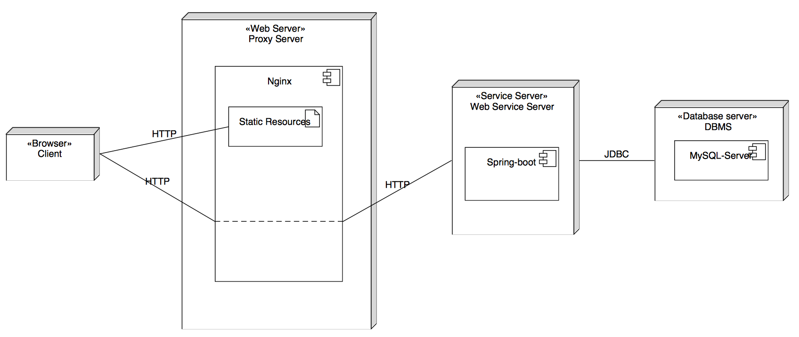

# Deployment

## UML Deployment



## Devices

* **Node**: One node on Aliyun
* **Memory**: 1GB
* **CPU**: 1 core
* **Band**: 1Mbps

## Demo

**Demo website address** : http://aliyun.kinpzz.com:8000

Due to the demand of records  of web server in China, we can not use 80 port with domain name without records in government. So we use 8000 port instead.

## Nginx

In order to hide the service port of web service server and database server ports from clients, which is not secure to expose them, we use Nginx as a reverse proxy.

We configure the `nginx.conf`on`/etc/nginx/nginx.conf`by adding server configuration on `http` tag.

```
...
       server {
                listen 8000;
                server_name aliyun.kinpzz.com:8000;
                charset utf-8;
                # 反向代理RESTful server
                location /api/ {
                        proxy_pass http://127.0.0.1:8082;
                }
                # 获取静态资源
                location / {
                                # 静态资源位置
                        root /root/data/webpage/dist;
                                index index.html;
                }
       }
...
```

Here, we use Nginx as static resources server. Client can directly request static resources from the 8000 port and Nginx will directly reply. And Nginx relay the api request to 8081 port on localhost, which web service server is listening. This is more secure than directly expose the service port to public. 

PS: We directly deploy the Nginx on the node, but not deploy the Nginx server on docker because it needs to use the port other servers expose on the localhost. If we use docker, it will be a more complicated case, for it needs to connect different ports between these docker containers it denpends on.

## Docker CD

Because we only have one node so we use docker container to simulate multiple nodes in the deployment. By using jenkins we can achieve continuous deployments on our node.

### Database Server

Run run.sh after jenkins scripts. To rebuild the latest image and run a new container depends on the image.

``` shell
docker stop db
docker rm db
docker rmi db-server
docker build -t db-server 
docker run -d --name db db-server
```

### Web Service

Run the run.sh after jenkins scripts.

```shell
export MAVEN_HOME=/opt/maven
export JAVA_HOME=/opt/java/jdk1.8.0_112
export JENKINS_HOME=/jenkins

mvn package
docker stop restful-server
docker rm restful-server
docker rmi kinpzz/restful-server
docker build -t kinpzz/restful-server .
docker run -d -p 127.0.0.1:8082:8082 --name restful-server --link db:db-server kinpzz/restful-server
```

Here, we use in maven in jenkins docker in order to use the maven package cache to speed up the build process. And copy the `.war` to execute in the new images instead of build the maven project in the new docker. And use ``--link`` tag to connect the web service container with database server container by bridge. So the web service container can connect to the port of database server without exposing the port of database server to public.


Here, we can deploy the new version once we commit the code to GitHub.

## TODO

Sometimes it faild by docker remove. May be it will be better to build the docker images on Aliyun and then pull them when we need to use it.

